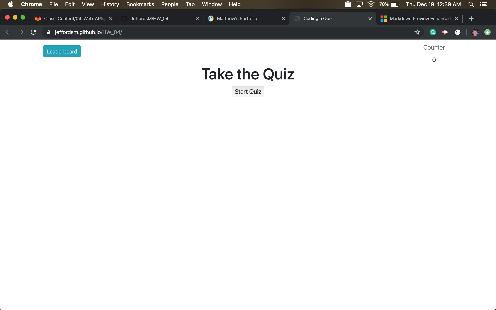

# HW 04
## About
The big issue I had with this project was the Leaderboard. I was having an issue saving the player name and the corrisponding score to local Storage. But that was my only real major hurdle. The way I changed the page several times was changing the class on certain divs when certain buttons were pushed. I used bootstrap for most of my buttons, my nav bar and my pop-up leaderboard. The Questions for the quiz are in an object and then I have a loop that calls upon each question in that object and generates the buttons and the text for each. 

https://jeffordsm.github.io/HW_04/